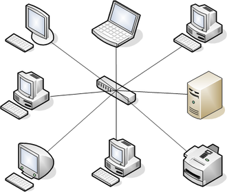
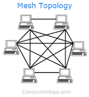

# Lecture 11 - The physical layer

- MAC address in the link layer

- How do we go to the analogue world?
    - 3 Main types:
    - Guided Media: Copper and Fiber
    - Wireless: terrestial radio
    - Underwater and Satellite Comms (Different mediums)

| Layer | Connection | 
| --- | --- |
| App Layer | Connection between applications |
| Transport Layer | Connection between processes |
| Network Layer | Connections between hosts |
| Link Layer | Connections between interfaces | 
| Physical Layer | (De)modulation and transmission of symbols, channel coding |

Modulations:
- Amplitude modulation
- Phase modulation 
- Frequency modulation

Coding:
- Level of signal -> 00, 01, 11 ...
- Interpretating bits as voltage (carries more information)

| Topologies | Figure | Explanation |
| --- | --- | --- |
| Star |  | Most commonly used in Lan |
| Ring |  | Proposed by IBM, not as commonly used. Each connected to exactly 2 other nodes |
| Bus |  | Used to be widely used, all modes connected to a single cable |
| Mesh |  | Most commonly used in wireless. All nodes work together to send to each other |

- T: denotes wireless
- S: denotes ethernet/fiber cable

---
Embedded System Networks
---
- Main difference: Internet is best effort
- For Embedded Systems, guarantee is important. 
    - Therefore, new layer 3 and 4 protocols are needed
    - Reduce overhead (IP/TCP requires a large overhead)
    - TCP/IP builds on steamining idea
    - TCP/IP is built based on best utilization of links with high traffic
    - Require real-time, very fast response times (for controlling cars, etc.)
    - Require reliable transmission (without re-transmission)
    - Constant network load and topology
    - Fixed allocation of bandwidth to "users"
    - Cost of components and implementation is important
    - Require (very often) **Master/Slave** architecture
    
- Therefore, we use:
    - Buses (Phy layer)
    - Every participant sees the message (broadcast)
    - Master gives all commands
    - Slaves connect to single bus

- However, have to consider:
    - Performance
        - Bandwidth
        - Error rate
        - Transmission delay
        - Tolerance to faults
    - Cost
        - Parts
        - Power
        - Licensing
        - Runtime complexity

---
- SCLK - Section/Slave/Serial Clock: used for synchronization
- MOSI - Master Output Slave Input
- MISO - Master Input Slave Output
---

- CAN(Controller Area Network) bus: 1 Master & 16 Slaves, cheap.
    - Check slide 45 for comparison reference

