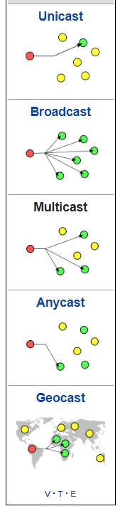

# IOT

---
Main difference between IOT and Embedded systems
---
| IOT | Embedded Systems |
| --- | --- | 
| Requires internet/Network | Can be standalone |
| IOT = ET + NT + IT (embedded tech, network tech, information tech) | Standalone smart system |
 

- Embedded Tech: Data collection technology/Control
- Information Tech: Applications and logic
- Network Tech: Wifi and Cloud

---

| Sensor | Actuator |
| --- | --- | 
| Gathers data from environment | Executes change in environment |

Casting:
- 

