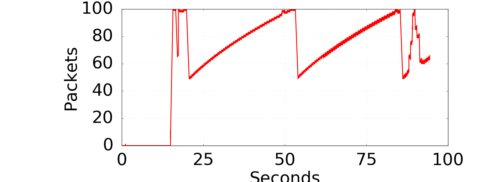
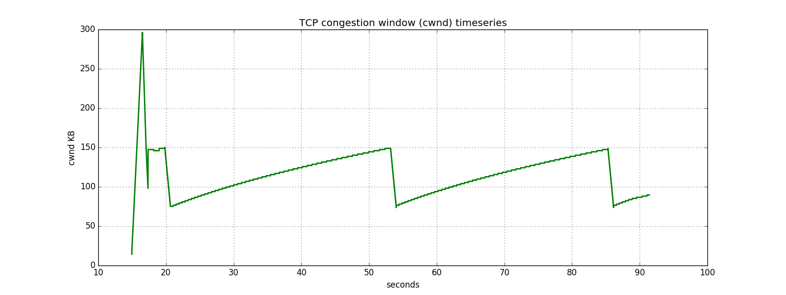
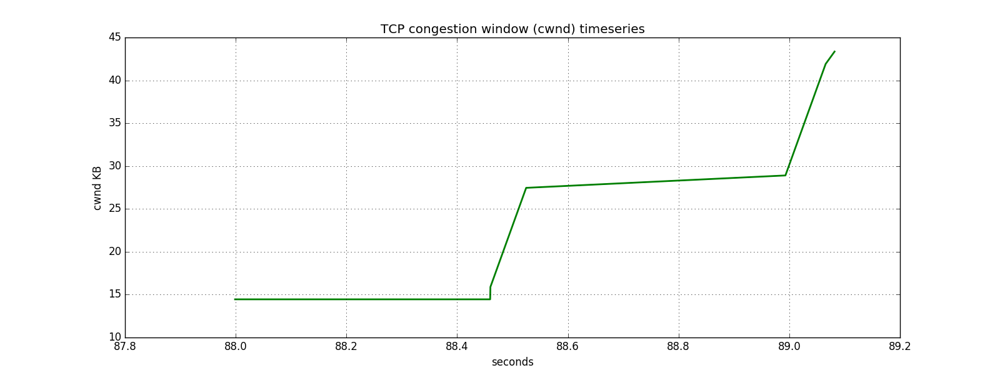
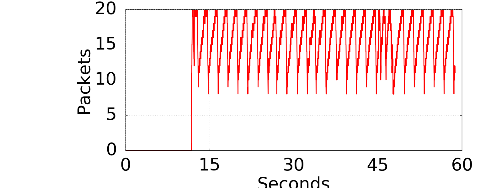
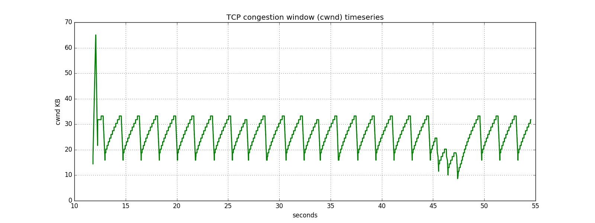
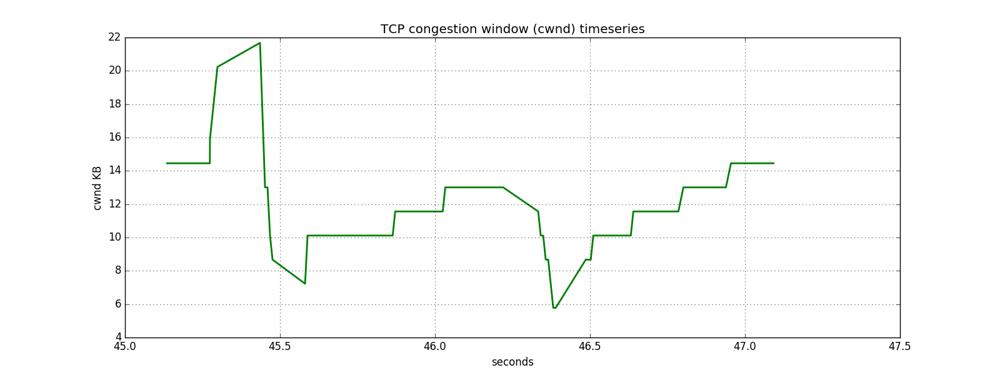

# Networks Lab 3

Name: Clemence Goh (1002075)

---
What is the normal time required to download the webpage on h1 from h2?
- Downloads in 1.0s

---
What was your initial expectation for the congestion window size over time?
- Expect that the congestion window increases over time.

---
After starting iperf on h1, did you observe something interesting in the ping RTT?
- ping RTT is much larger/longer

---
After starting iperf on h1, why does the web page take so much longer to download?
- Due to parallel streaming of data using iperf, the download channel is shared between 
streaming and downloading the web page, which means that packets sent by the web page 
will be acknowledged slower.


---
Please provide the figures for the first experiment (with qlen 100 and only one queue)
- Please comment on what you can see in the figures 

Buffer occupancy:


Cwnd for long-lived iperf flow:


Cwnd for short-lived wget flow:


For the first ~88 seconds, only the long-lived iperf flow is active.
It increases exponentially from 15-16s, where it encountered its first packet loss event.
At this point the buffer was full at 100 packets.
There is a second loss event encountered around the 20 second mark, whereby thereafter the
iperf enters congestion avoidance mode for the rest of the duration.

A similar behaviour is observed from the short-lived wget, whereby it does a
slow start, and entering congestion avoidance mode after.

---
Please provide the figures for the second experiment (with qlen 20 and only one queue)
- Please comment on what you can see in the figures, and what is different (any why)


Buffer occupancy:


Cwnd for long-lived iperf flow:


Cwnd for short-lived wget flow:


For the first 45 seconds, only the long-lived iperf flow is active.
Similar to the previous experiment, a slow start is observed,
followed by congestion avoidance mode, showing the sawtooth shape.

The difference is that the cwnd size is much smaller.
Since the qlen size is set at 20 instead of 100, it limits the number
of packets that can be sent through at a time.


---

Instruction for Lab 3:
1)	Run server.py first
2)	In client.py, under:
```
if __name__ == "_main_":
    clientSide(_rate=1.65)
```

Change the value of rate to whatever desired value.
Note: we are assuming that packets are dropped only when rate >= 1.65

3)	Then run client.py
4)	Report will be shown in the terminal


