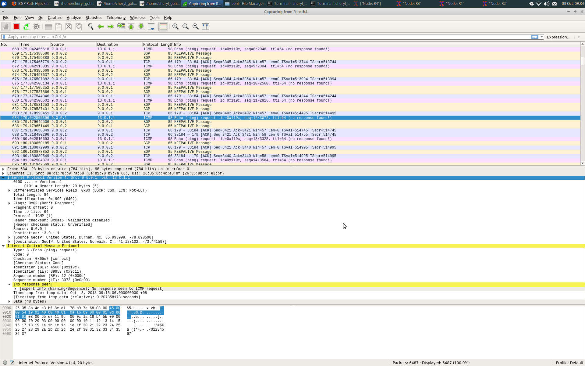

# Lab 4 
Name: Clemence Goh (1002075)
Partner: Cheryl Goh (1002421)

---
Topology:
- IP addresses

| router | IP address |
| --- | --- |
| 1 | 9.0.0.1 |
| 2 | 9.0.0.2 |
| 3 | 9.0.1.2 |

- Hosts/IPs in the ASs

| Host | IP | 
| --- | --- | 
| h11 | 11.0.1.1 | 
| h12 | 11.0.2.1 |
| h13 | 11.0.3.1 |
| h21 | 12.0.1.1 |
| h22 | 12.0.2.1 |
| h23 | 12.0.3.1 |
| h31 | 13.0.1.1 |
| h32 | 13.0.2.1 |
| h33 | 13.0.3.1 |

---
Why was it initially not possible to reach 13.0.1.1 from AS1?
- No

How did you find out/what did you do to fix this?
- ping 13.0.1.1 from R1
- IP address 9.0.0.0 was missing from R3.
- This meant that R3 was receiving the ping requests from R1,
but was unable to reply due to the reply address of R1 being missing.
- Use command:
```
R3 route add -net 9.0.0.0 netmask 255.255.255.0 gw 9.0.1.1
```
- This command adds R1's reply address to R3

- Wireshark capture:



---
Describe the BGP traffic you were able to observe during re-establishment of routes.
- During re-establishment of routes, 
it can be seen that there are NOTIFICATION and OPEN messages, 
followed by subsequent KEEPALIVE messages after the routes have 
been re-established.


---
Describe in detail what happened when you started the attack on BGP.
- Before starting the attack, the initial contact with the 
webserver replies “Default web server’” when the website.sh script is executed. 
Wireshark also shows that the packets were indeed being forwarded 
from 9.0.0.1 (R1) to the real destination 13.0.1.1 at 
AS3 and that the message being sent back to R1 was indeed from 
the default webserver.

- After launching the attack by making changes to the 
bgpd-R4.conf by changing the Malicious network R4 to be the 
same as R3, by changing 14.0.0.0/8 to 13.0.0.0/8. 
Because it requires lesser hops to get to R3, 
the malicious network, R4, receives priority over R3 and gets 
traffic going to R3 redirected to itself.

- The packets are now being forwarded from 9.0.4.1 
from R4 which is from the attacker at AS4 to the spoofed 
destination 13.0.1.1 at AS4.


