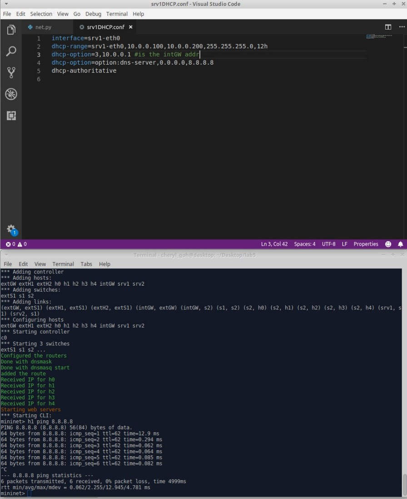

# Lab 5 - Network

Name: Clemence Goh (1002075)

Worked with: Cheryl Goh(1002421)

---
**Brief description of the network setup provided:**

---
- **IP subnet for the desktops and server**
    - 10.0.0.0
- **Which server is acting as DHCP server**
    - Server 1. We can observe from wireshark that DHCP
    traffic is in server 1 and not server 2.
- **What you had to fix in the DHCP setup to reach 8.8.8.8**    
    - To fix the DHCP setup, change config file's 
    `dhcp-option:3` address from `10.0.0.111` to `10.0.0.1`. 
    This is to correctly route the packets through intGW.
    - Initially, DHCP broadcasted to the wrong default gateway IP,
    which does not exist. Therefore, packet was lost.

---
**Why can you resolve nils.net? Briefly describe where from h1 knows
about a DNS server, and what its IP is.**

- nils.net has an IP of 8.8.8.2, which is associated to 8.8.8.8 (DNS)
- Initially, h1 uses localhost (127.0.0.1) as the DNS server but does not
have an entry for nils.net initially. Hence, change in DNS server to 8.8.8.8
by modifying the resolv.conf file allows h1 to successfully ping nils.net
since 8.8.8.8 has an entry for nils.net.

**Who is doing the NAT'ing? Which address ranges it is translating
between?**
- IntGW is doing the NAT'ing.
- The address range it is translating is between private IP addresses
10.0.0.0/24 and (10.0.0.1 - 10.0.0.254) and public IP addresses 2.2.2.2/24

---
**Did you manage to block srv1 from reaching the outside world?**
- Yes, blocked srv2 from reaching the outside world by executing the 
commands "`iptables -l FORWARD -s 10.0.0.11 -j DROP`", and "`iptables 
-l INPUT -s 10.0.0.11 -j DROP`".
- srv2 IP: 10.0.0.11

---
**Did you do any of the optional tasks?**
- No